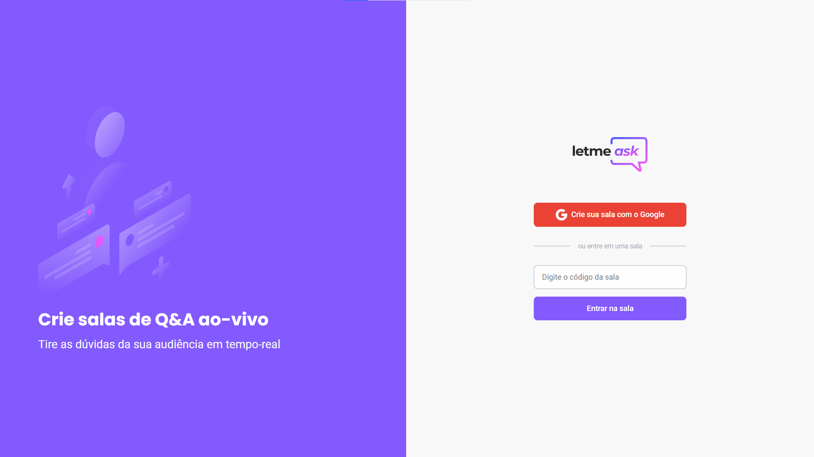
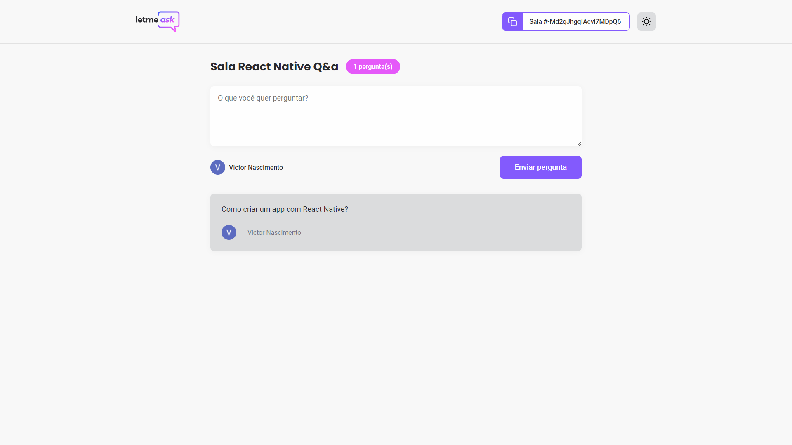
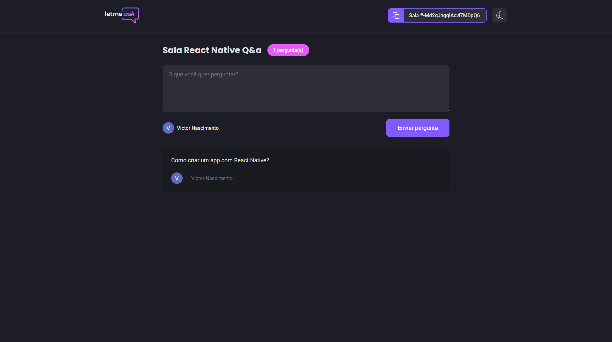

  

<h1 align = "center">
    
    
    
</h1>

## 🧪 Tecnologias

Este projeto foi desenvolvido utilizando as seguintes tecnologias:

- [React] (https://reactjs.org)
- [Firebase] (https://firebase.google.com/)
- [TypeScript] (https://www.typescriptlang.org/)
## 🚀 Como executar

- Clone o repositório
- Instale as dependências com `yarn`
- Inicie a fake api com `yarn server`
- Inicie o servidor com `yarn dev`

Agora você pode acessar [`localhost:3000`](http://localhost:3000) do seu navegador.

## 📝 Licença

Este projeto está licenciado sob a Licença MIT. Consulte o arquivo [LICENSE] (LICENSE.md) para obter detalhes.

---

 Fabricado com 💜 por José Victor 

